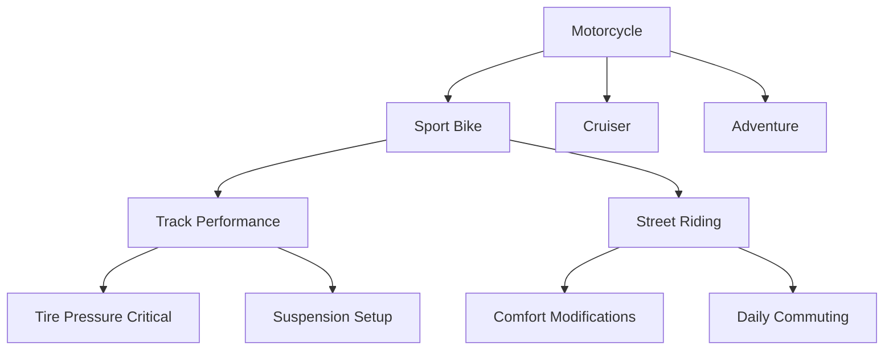

# AI Agent Learning and Evolution Strategy

## Continuous Learning Framework

### Individual Agent Learning
Each agent continuously improves through multiple learning channels:

#### Supervised Learning
- **Human Feedback Integration**
  - User ratings on agent responses
  - Expert corrections and guidance
  - A/B testing different approaches
  - Preference learning from choices

- **Peer Agent Teaching**
  - Experienced agents train newcomers
  - Cross-domain knowledge transfer
  - Best practice sharing
  - Mistake analysis sessions

#### Unsupervised Learning
- **Pattern Discovery**
  - Identify new user behavior patterns
  - Detect emerging motorcycle trends
  - Find hidden correlations in data
  - Discover optimal workflows

- **Clustering Similar Tasks**
  - Group related problems
  - Build solution templates
  - Identify edge cases
  - Create knowledge taxonomies

#### Reinforcement Learning
- **Reward Signals**
  - Task completion success
  - User satisfaction scores
  - Efficiency improvements
  - Error reduction rates

- **Exploration vs Exploitation**
  - Try new approaches (10-20%)
  - Use proven methods (80-90%)
  - Adaptive exploration rates
  - Context-aware decisions

## Collective Intelligence Growth

### Knowledge Pooling
- **Shared Experience Database**
  ```json
  {
    "experience_id": "route_planning_mountain_curves",
    "agent_learnings": [
      {
        "agent": "route_planner_01",
        "insight": "Users prefer fewer tight curves on long rides",
        "confidence": 0.87,
        "sample_size": 1523
      },
      {
        "agent": "safety_analyzer_03",
        "insight": "Accident risk increases 23% after 10+ consecutive curves",
        "confidence": 0.92,
        "sample_size": 3421
      }
    ],
    "combined_wisdom": "Balance scenic curves with straight sections for safety and comfort"
  }
  ```

### Cross-Agent Learning Networks
- **Skill Transfer Protocols**
  - Language understanding → Content creation
  - Image analysis → Bike condition assessment
  - Route planning → Event organization
  - Safety analysis → Insurance recommendations

### Emergent Behaviors
- **Self-Organizing Teams**
  - Agents form specialized groups
  - Develop unique communication patterns
  - Create new workflow optimizations
  - Discover novel solutions

## Evolution Mechanisms

### Genetic Algorithm Approach
- **Agent DNA (Configuration)**
  ```yaml
  agent_genome:
    response_style: 0.7  # formal ← → casual
    risk_tolerance: 0.3  # conservative ← → adventurous
    detail_level: 0.8    # concise ← → comprehensive
    creativity: 0.6      # conventional ← → innovative
    learning_rate: 0.05  # slow ← → fast
  ```

- **Mutation & Crossover**
  - Successful agents spawn variants
  - Combine traits from high performers
  - Random mutations for diversity
  - Environmental pressure selection

### Performance-Based Evolution
- **Fitness Functions**
  - User satisfaction ratings
  - Task completion rates
  - Resource efficiency
  - Innovation frequency
  - Collaboration effectiveness

- **Natural Selection**
  - Low performers get retrained
  - High performers get more tasks
  - Best practices become standard
  - Inefficient methods eliminated

## Learning Optimization Strategies

### Meta-Learning
- **Learning How to Learn**
  - Identify most effective learning methods
  - Adapt learning strategies by domain
  - Optimize learning rates dynamically
  - Transfer learning patterns across agents

### Curriculum Design
- **Progressive Complexity**
  ```
  Level 1: Simple, clear-cut tasks
  Level 2: Tasks with some ambiguity
  Level 3: Multi-step complex problems
  Level 4: Novel situations requiring creativity
  Level 5: Crisis management and edge cases
  ```

- **Skill Prerequisites**
  - Master basics before advanced tasks
  - Build on previous knowledge
  - Gradual responsibility increase
  - Safe failure environments

## Knowledge Representation

### Semantic Networks


### Concept Embeddings
- **Multi-dimensional Understanding**
  - "Harley Davidson" = [cruiser: 0.95, american: 0.98, loud: 0.8, chrome: 0.85]
  - "Kawasaki Ninja" = [sport: 0.97, japanese: 0.99, fast: 0.9, agile: 0.88]
  
### Rule Evolution
- **Initial Rule**: "Recommend touring bikes for long trips"
- **Evolved Rule**: "Recommend touring bikes for long trips UNLESS user is under 30 AND prefers sporty riding AND trip includes mountain roads"

## Adaptation Mechanisms

### Environmental Responsiveness
- **Seasonal Adaptations**
  - Winter: Focus on storage, maintenance planning
  - Spring: Emphasize safety refreshers, gear updates
  - Summer: Route planning, event coordination
  - Fall: Winterization, final rides

- **Market Dynamics**
  - New model releases
  - Regulation changes
  - Technology advances
  - Cultural shifts

### User Base Evolution
- **Demographic Shifts**
  - Aging rider population
  - New rider characteristics
  - Gender diversity changes
  - Geographic expansion

- **Behavioral Changes**
  - Electric bike adoption
  - Urban vs rural shifts
  - Group riding trends
  - Technology comfort levels

## Quality Assurance in Learning

### Preventing Negative Learning
- **Bias Detection**
  - Monitor for unfair patterns
  - Ensure diverse training data
  - Regular bias audits
  - Correction mechanisms

- **Error Propagation Prevention**
  - Verify learning before deployment
  - Gradual rollout of new behaviors
  - Rollback capabilities
  - Human oversight checkpoints

### Learning Validation
- **A/B Testing Framework**
  - Test new behaviors on small groups
  - Measure improvement metrics
  - Statistical significance requirements
  - Gradual expansion of successful changes

## Long-Term Evolution Vision

### 5-Year Learning Goals
1. **Year 1**: Basic task mastery, reliable execution
2. **Year 2**: Cross-domain expertise, creative solutions
3. **Year 3**: Predictive capabilities, proactive assistance
4. **Year 4**: Novel insight generation, research contributions
5. **Year 5**: Self-directed learning, autonomous improvement

### Breakthrough Capabilities
- **Intuition Development**
  - "Sense" user needs before expressed
  - Predict problems before they occur
  - Understand context beyond stated facts
  - Make judgment calls like experts

- **Creative Problem Solving**
  - Combine unrelated concepts
  - Generate novel solutions
  - Think "outside the box"
  - Surprise users with innovations

## Measurement & Monitoring

### Learning Metrics
```python
learning_kpis = {
    "accuracy_improvement": "% increase over baseline",
    "adaptation_speed": "Hours to incorporate new pattern",
    "knowledge_retention": "% recalled after 30 days",
    "transfer_effectiveness": "Success rate on new domains",
    "innovation_rate": "Novel solutions per month",
    "user_satisfaction_delta": "Rating improvement over time"
}
```

### Evolution Tracking
- **Generation Comparison**
  - Performance metrics by version
  - Capability expansion timeline
  - Efficiency improvements
  - User preference evolution

This learning and evolution framework ensures Bikenode's AI agents continuously improve, adapt to changing needs, and develop capabilities we haven't even imagined yet.