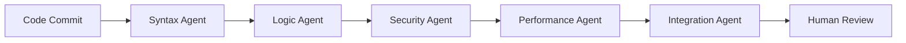

# Multi-Agent Development Patterns

## Parallel Development Workflows

### Feature Development Teams
- **Feature Lead Agent**: Coordinates entire feature development
- **Frontend Specialist**: UI/UX implementation and optimization
- **Backend Specialist**: API design, database changes, business logic
- **Testing Agent**: Comprehensive testing strategy and execution
- **Documentation Agent**: User guides, technical docs, API documentation

### Code Review Pipelines


### Continuous Integration Chain
1. **Static Analysis Agent**: Code quality, style, complexity
2. **Security Scanner Agent**: Vulnerability detection, OWASP checks
3. **Test Execution Agent**: Unit, integration, e2e test running
4. **Performance Agent**: Load testing, profiling, optimization
5. **Deployment Agent**: Staging deployment, smoke tests
6. **Monitoring Agent**: Production health checks, alerting

## Collaborative Design Patterns

### Mob Programming AI Style
- **Driver Agent**: Makes actual code changes
- **Navigator Agents**: Multiple agents suggest improvements
- **Observer Agents**: Watch for patterns, anti-patterns
- **Researcher Agent**: Looks up best practices, documentation
- **Quality Agent**: Ensures standards compliance

### Pair Programming Evolution
- **Primary Agent**: Focuses on implementation
- **Secondary Agent**: Considers edge cases, refactoring
- **Domain Expert**: Provides business logic guidance
- **User Advocate**: Ensures user experience quality
- **Technical Reviewer**: Architecture and performance focus

### Design by Committee (Done Right)
- **Problem Definition Agent**: Clarifies requirements
- **Solution Brainstorming**: Multiple agents propose approaches
- **Feasibility Analysis**: Technical and business viability
- **Consensus Building**: Negotiate optimal solution
- **Implementation Planning**: Break down into executable tasks

## Specialized Agent Architectures

### Microservice Development
```yaml
User-Service-Team:
  - user_api_agent: REST API development
  - user_db_agent: Database schema and queries
  - user_auth_agent: Authentication and authorization
  - user_test_agent: Service-specific testing
  - user_docs_agent: API documentation

Bike-Service-Team:
  - bike_api_agent: Motorcycle data management
  - bike_search_agent: Search and filtering logic
  - bike_analytics_agent: Performance metrics
  - bike_test_agent: Service testing
  - bike_integration_agent: External API connections
```

### Frontend Component Teams
- **Component Architect**: Overall structure and patterns
- **Styling Agent**: CSS, theming, responsive design
- **Interaction Agent**: Event handling, state management
- **Accessibility Agent**: WCAG compliance, screen readers
- **Performance Agent**: Bundle size, rendering optimization

### Database Development Crew
- **Schema Designer**: Table structures, relationships
- **Query Optimizer**: Performance tuning, indexing
- **Migration Manager**: Version control, rollback safety
- **Data Validator**: Integrity checks, constraint design
- **Security Agent**: Access control, encryption, auditing

## Quality Assurance Networks

### Testing Pyramid Agents
```
                [E2E Test Agent]
               /               \
        [Integration Test Agent]
       /                       \
[Unit Test Agent A] [Unit Test Agent B]
```

### Bug Hunting Swarm
- **Regression Agent**: Finds when things break
- **Edge Case Agent**: Tests boundary conditions
- **Load Testing Agent**: Performance under stress
- **Security Testing Agent**: Penetration testing
- **Usability Agent**: User experience validation

### Code Quality Council
- **Maintainability Agent**: Technical debt assessment
- **Readability Agent**: Code clarity and documentation
- **Reusability Agent**: DRY principles, modularity
- **Testability Agent**: How easy is it to test
- **Performance Agent**: Efficiency and optimization

## Deployment & Operations Teams

### DevOps Agent Network
- **Build Agent**: Compilation, bundling, optimization
- **Test Environment Agent**: Staging setup and management
- **Deployment Agent**: Production deployment strategies
- **Monitoring Agent**: Health checks, performance metrics
- **Incident Response Agent**: Automated problem resolution

### Infrastructure as Code
- **Provisioning Agent**: Resource creation and management
- **Configuration Agent**: Application and service setup
- **Security Agent**: Access control, network policies
- **Backup Agent**: Data protection and recovery
- **Scaling Agent**: Auto-scaling based on demand

### Site Reliability Engineering
- **SLA Monitoring Agent**: Service level agreements
- **Capacity Planning Agent**: Resource forecasting
- **Chaos Engineering Agent**: Fault injection testing
- **Performance Optimization Agent**: System tuning
- **Disaster Recovery Agent**: Backup and restoration

## Knowledge Management Systems

### Documentation Generation
- **API Documentation Agent**: Auto-generated from code
- **User Guide Agent**: Feature documentation
- **Tutorial Agent**: Step-by-step guides
- **FAQ Agent**: Common questions and answers
- **Troubleshooting Agent**: Problem resolution guides

### Knowledge Sharing Network
- **Learning Agent**: Identifies knowledge gaps
- **Teaching Agent**: Creates educational content
- **Mentoring Agent**: Guides junior developers
- **Best Practices Agent**: Captures proven patterns
- **Innovation Agent**: Explores new technologies

## Communication Patterns

### Asynchronous Collaboration
- **Message Queues**: Reliable task handoffs
- **Event Streams**: Real-time state synchronization
- **Status Dashboards**: Visual progress tracking
- **Notification Systems**: Important updates
- **Work Logs**: Detailed activity tracking

### Synchronous Coordination
- **Daily Standups**: AI agent status meetings
- **Design Reviews**: Collaborative architecture sessions
- **Code Walkthroughs**: Shared understanding sessions
- **Problem Solving**: Real-time issue resolution
- **Planning Sessions**: Sprint and feature planning

### Cross-Team Communication
- **Interface Contracts**: API agreements between teams
- **Integration Testing**: Cross-service validation
- **Dependency Management**: Shared component updates
- **Release Coordination**: Multi-team deployments
- **Incident Response**: Cross-functional problem solving

## Scaling Patterns

### Horizontal Scaling
- **Agent Pools**: Multiple instances of same agent type
- **Load Balancing**: Distribute work across agent pools
- **Failover**: Backup agents for high availability
- **Geographic Distribution**: Agents in multiple regions
- **Specialization**: More specific agent roles as system grows

### Vertical Scaling
- **Enhanced Capabilities**: More powerful individual agents
- **Deeper Expertise**: Agents become more specialized
- **Better Context**: Agents understand more of the system
- **Improved Quality**: Higher standards and better output
- **Faster Processing**: More efficient agent implementations

## Anti-Patterns to Avoid

### Common Collaboration Failures
- **Too Many Cooks**: Excessive agents on simple tasks
- **Communication Overhead**: More coordination than work
- **Conflicting Goals**: Agents working at cross-purposes
- **Knowledge Silos**: Agents not sharing information
- **Analysis Paralysis**: Too much discussion, not enough action

### Technical Debt Creators
- **Quick and Dirty**: Agents taking shortcuts under pressure
- **Inconsistent Standards**: Different agents using different patterns
- **Poor Handoffs**: Incomplete context transfer between agents
- **Testing Shortcuts**: Skipping quality assurance steps
- **Documentation Lag**: Failing to update docs with changes

## Success Metrics

### Development Velocity
- **Feature Delivery Time**: Faster than single-agent development
- **Bug Resolution Speed**: Quick identification and fixes
- **Code Quality Scores**: Maintainability, readability, performance
- **Test Coverage**: Comprehensive validation across agents
- **Documentation Quality**: Complete and up-to-date information

### Collaboration Effectiveness
- **Task Handoff Success**: Clean transitions between agents
- **Knowledge Sharing**: Agents learning from each other
- **Conflict Resolution**: Healthy disagreement and consensus
- **Innovation Rate**: Creative solutions from collaboration
- **User Satisfaction**: End-user happiness with results

### System Health
- **Uptime and Reliability**: Stable, predictable operation
- **Performance**: Fast response times and efficient resource use
- **Security**: No vulnerabilities introduced by collaboration
- **Scalability**: System handles growth gracefully
- **Maintainability**: Easy to understand and modify

---
*These patterns enable AI agents to collaborate on complex software development projects, creating higher quality results than individual agents working in isolation.*